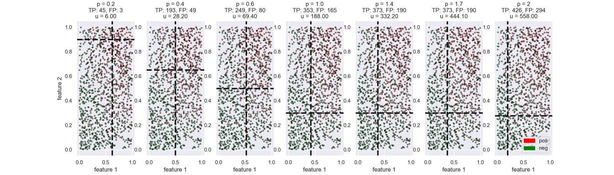

<input class="sk-toggleable__control sk-hidden--visually" id="124d9180-38f7-4cbe-a844-51823d34826f" type="checkbox" ><label class="sk-toggleable__label" for="124d9180-38f7-4cbe-a844-51823d34826f">Pipe</label>
<pre></pre>

<input class="sk-toggleable__control sk-hidden--visually" id="35434337-447b-4d6d-ab93-84baaf9cd94f" type="checkbox" ><label class="sk-toggleable__label" for="35434337-447b-4d6d-ab93-84baaf9cd94f">ReadAlerts</label>
<pre>rows:6000</pre>

<input class="sk-toggleable__control sk-hidden--visually" id="2aca39e0-59fc-4e7a-a695-34db7faa5fd0" type="checkbox" ><label class="sk-toggleable__label" for="2aca39e0-59fc-4e7a-a695-34db7faa5fd0">ptransff: PPipe</label>
<pre></pre>

<input class="sk-toggleable__control sk-hidden--visually" id="255588df-6c2f-4b7c-91b9-cd0e121644af" type="checkbox" ><label class="sk-toggleable__label" for="255588df-6c2f-4b7c-91b9-cd0e121644af">ExtractFeatures_00</label>
<pre>parallel</pre>

<input class="sk-toggleable__control sk-hidden--visually" id="400bf793-1302-4604-88b2-dc27fbb05306" type="checkbox" ><label class="sk-toggleable__label" for="400bf793-1302-4604-88b2-dc27fbb05306">FilterAlerts</label>
<pre>rows:1200
   N    P  rate
 720  480   0.4</pre>

<input class="sk-toggleable__control sk-hidden--visually" id="2c073021-eace-460f-8b4b-b5ab752f940d" type="checkbox" ><label class="sk-toggleable__label" for="2c073021-eace-460f-8b4b-b5ab752f940d">ExtractFeatures_00</label>
<pre>rows:1200</pre>

<input class="sk-toggleable__control sk-hidden--visually" id="c3f1947a-4c34-437f-9a26-12fd01e8085a" type="checkbox" ><label class="sk-toggleable__label" for="c3f1947a-4c34-437f-9a26-12fd01e8085a">Transformer</label>
<pre>rows:1200
transformer:
quantile</pre>

<input class="sk-toggleable__control sk-hidden--visually" id="f8bd9928-38f8-4d58-b0ac-ce029b608b13" type="checkbox" ><label class="sk-toggleable__label" for="f8bd9928-38f8-4d58-b0ac-ce029b608b13">Train</label>
<pre>rows:7
        p   TP   FP  rate
sc                       
SC00  0.2    2    0  0.00
SC00  0.4    2    0  0.00
SC00  0.6   11    5  0.31
SC00  1.0   23   17  0.42
SC00  1.4  317  422  0.57
SC00  1.7  355  481  0.58
SC00  2.0  464  675  0.59</pre>

<input class="sk-toggleable__control sk-hidden--visually" id="77dbcd9d-9979-45dd-807b-1043705129fd" type="checkbox" ><label class="sk-toggleable__label" for="77dbcd9d-9979-45dd-807b-1043705129fd">ExtractFeatures_01</label>
<pre>parallel</pre>

<input class="sk-toggleable__control sk-hidden--visually" id="719cfa6f-4040-42aa-8aad-fd0c4841afc4" type="checkbox" ><label class="sk-toggleable__label" for="719cfa6f-4040-42aa-8aad-fd0c4841afc4">FilterAlerts</label>
<pre>rows:1200
   N    P  rate
 720  480   0.4</pre>

<input class="sk-toggleable__control sk-hidden--visually" id="2c8431be-ab38-4c89-8a1b-f1688f83eefe" type="checkbox" ><label class="sk-toggleable__label" for="2c8431be-ab38-4c89-8a1b-f1688f83eefe">ExtractFeatures_01</label>
<pre>rows:1200</pre>

<input class="sk-toggleable__control sk-hidden--visually" id="b7449f9a-ccb7-4036-97f7-b75b1582c540" type="checkbox" ><label class="sk-toggleable__label" for="b7449f9a-ccb7-4036-97f7-b75b1582c540">Transformer</label>
<pre>rows:1200
transformer:
quantile</pre>

<input class="sk-toggleable__control sk-hidden--visually" id="1aa5acfb-ccaf-4dda-ab3d-8f70d50a49ef" type="checkbox" ><label class="sk-toggleable__label" for="1aa5acfb-ccaf-4dda-ab3d-8f70d50a49ef">Train</label>
<pre>rows:7
        p   TP   FP  rate
sc                       
SC01  0.2    0    0   NaN
SC01  0.4    0    0   NaN
SC01  0.6    0    0   NaN
SC01  1.0  375  358  0.49
SC01  1.4  395  381  0.49
SC01  1.7  435  438  0.50
SC01  2.0  444  455  0.51</pre>

<input class="sk-toggleable__control sk-hidden--visually" id="bc14f301-6758-4672-91a3-bebb748c641c" type="checkbox" ><label class="sk-toggleable__label" for="bc14f301-6758-4672-91a3-bebb748c641c">ExtractFeatures_02</label>
<pre>parallel</pre>

<input class="sk-toggleable__control sk-hidden--visually" id="5be31d90-3525-41c4-b5a5-5f0d154a645e" type="checkbox" ><label class="sk-toggleable__label" for="5be31d90-3525-41c4-b5a5-5f0d154a645e">FilterAlerts</label>
<pre>rows:1200
   N    P  rate
 720  480   0.4</pre>

<input class="sk-toggleable__control sk-hidden--visually" id="c81501fa-e044-4d42-9fed-a0b7194050d1" type="checkbox" ><label class="sk-toggleable__label" for="c81501fa-e044-4d42-9fed-a0b7194050d1">ExtractFeatures_02</label>
<pre>rows:1200</pre>

<input class="sk-toggleable__control sk-hidden--visually" id="19ac8e8d-f1ca-4023-a66f-74c55ed04e5b" type="checkbox" ><label class="sk-toggleable__label" for="19ac8e8d-f1ca-4023-a66f-74c55ed04e5b">Transformer</label>
<pre>rows:1200
transformer:
quantile</pre>

<input class="sk-toggleable__control sk-hidden--visually" id="f6cca68a-f3fb-42a9-b72b-f0ff8e1002b9" type="checkbox" ><label class="sk-toggleable__label" for="f6cca68a-f3fb-42a9-b72b-f0ff8e1002b9">Train</label>
<pre>rows:7
        p   TP   FP  rate
sc                       
SC02  0.2   45    3  0.06
SC02  0.4  193   49  0.20
SC02  0.6  249   80  0.24
SC02  1.0  353  165  0.32
SC02  1.4  373  190  0.34
SC02  1.7  373  190  0.34
SC02  2.0  426  294  0.41</pre>

<input class="sk-toggleable__control sk-hidden--visually" id="c624c556-bb04-43c9-ab44-0a5652551d6a" type="checkbox" ><label class="sk-toggleable__label" for="c624c556-bb04-43c9-ab44-0a5652551d6a">ExtractFeatures_03</label>
<pre>parallel</pre>

<input class="sk-toggleable__control sk-hidden--visually" id="768c771d-2a2c-42ab-bc03-26f4cccfef10" type="checkbox" ><label class="sk-toggleable__label" for="768c771d-2a2c-42ab-bc03-26f4cccfef10">FilterAlerts</label>
<pre>rows:1200
   N    P  rate
 720  480   0.4</pre>

<input class="sk-toggleable__control sk-hidden--visually" id="8e62add2-b919-4628-b641-156f2c2d9f48" type="checkbox" ><label class="sk-toggleable__label" for="8e62add2-b919-4628-b641-156f2c2d9f48">ExtractFeatures_03</label>
<pre>rows:1200</pre>

<input class="sk-toggleable__control sk-hidden--visually" id="174c2b7c-c5ba-49cd-ab95-3cfb25e79edb" type="checkbox" ><label class="sk-toggleable__label" for="174c2b7c-c5ba-49cd-ab95-3cfb25e79edb">Transformer</label>
<pre>rows:1200
transformer:
quantile</pre>

<input class="sk-toggleable__control sk-hidden--visually" id="c9c66930-854a-4219-bd3f-c5f8256a3c2a" type="checkbox" ><label class="sk-toggleable__label" for="c9c66930-854a-4219-bd3f-c5f8256a3c2a">Train</label>
<pre>rows:7
        p   TP   FP  rate
sc                       
SC03  0.2  129   17  0.12
SC03  0.4  316   66  0.17
SC03  0.6  347   79  0.19
SC03  1.0  414  128  0.24
SC03  1.4  420  136  0.24
SC03  1.7  434  157  0.27
SC03  2.0  440  168  0.28</pre>

<input class="sk-toggleable__control sk-hidden--visually" id="6044eeba-6ca3-4621-a730-f8098f873922" type="checkbox" ><label class="sk-toggleable__label" for="6044eeba-6ca3-4621-a730-f8098f873922">ExtractFeatures_04</label>
<pre>parallel</pre>

<input class="sk-toggleable__control sk-hidden--visually" id="1d677b08-9923-48de-8f11-2cd4b78c9814" type="checkbox" ><label class="sk-toggleable__label" for="1d677b08-9923-48de-8f11-2cd4b78c9814">FilterAlerts</label>
<pre>rows:1200
   N    P  rate
 720  480   0.4</pre>

<input class="sk-toggleable__control sk-hidden--visually" id="3c4517db-3438-41fb-aa11-38f770203c07" type="checkbox" ><label class="sk-toggleable__label" for="3c4517db-3438-41fb-aa11-38f770203c07">ExtractFeatures_04</label>
<pre>rows:1200</pre>

<input class="sk-toggleable__control sk-hidden--visually" id="9fbe66bc-74c9-4264-88df-9073923e39f9" type="checkbox" ><label class="sk-toggleable__label" for="9fbe66bc-74c9-4264-88df-9073923e39f9">Transformer</label>
<pre>rows:1200
transformer:
quantile</pre>

<input class="sk-toggleable__control sk-hidden--visually" id="f1e03467-a0bf-45a6-8d3c-2a59bab249ef" type="checkbox" ><label class="sk-toggleable__label" for="f1e03467-a0bf-45a6-8d3c-2a59bab249ef">Train</label>
<pre>rows:7
        p   TP   FP  rate
sc                       
SC04  0.2    0    0   NaN
SC04  0.4    0    0   NaN
SC04  0.6    0    0   NaN
SC04  1.0    0    0   NaN
SC04  1.4    0    0   NaN
SC04  1.7  480  719   0.6
SC04  2.0  480  719   0.6</pre>

<input class="sk-toggleable__control sk-hidden--visually" id="5a17dcc0-9f44-4dd5-a66e-670914c0a275" type="checkbox" ><label class="sk-toggleable__label" for="5a17dcc0-9f44-4dd5-a66e-670914c0a275">Concat</label>
<pre>rows:35</pre>

<input class="sk-toggleable__control sk-hidden--visually" id="5919d33b-a4b3-493c-a779-912d170c9a5b" type="checkbox" ><label class="sk-toggleable__label" for="5919d33b-a4b3-493c-a779-912d170c9a5b">Statistics</label>
<pre>     true_pos  false_pos   fp_rate
p                                 
0.2       176         20  0.102041
0.4       511        115  0.183706
0.6       607        164  0.212711
1.0      1165        668  0.364430
1.4      1505       1129  0.428626
1.7      2077       1985  0.488676
2.0      2254       2311  0.506243</pre>

            

            
            
            

             
            
             
            
             
            
             
            
             
            
    
            
